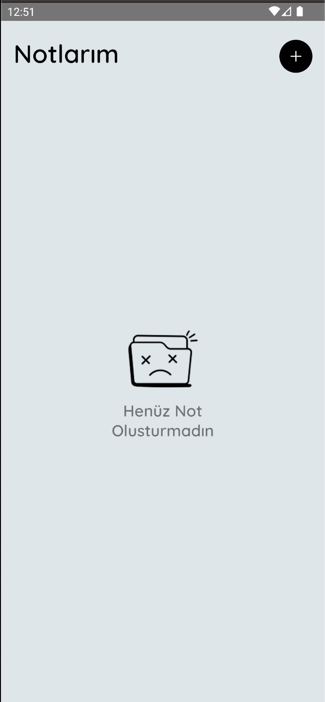
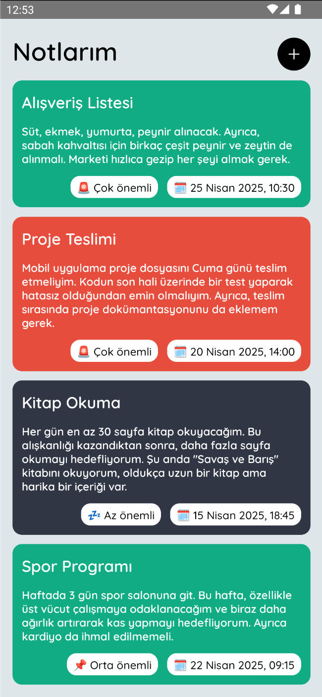
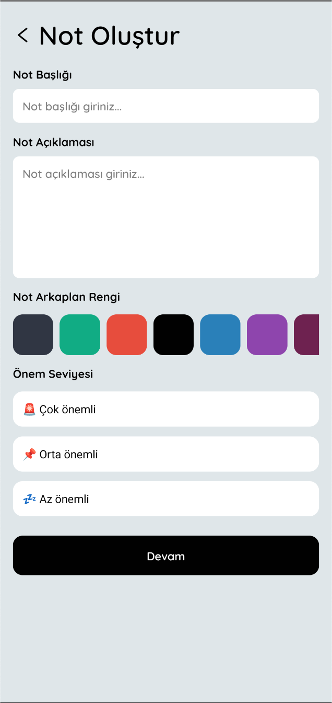
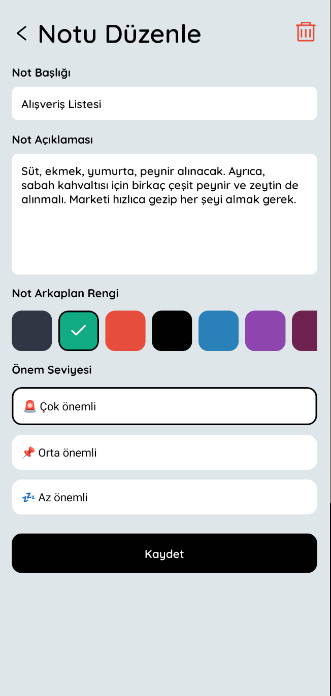
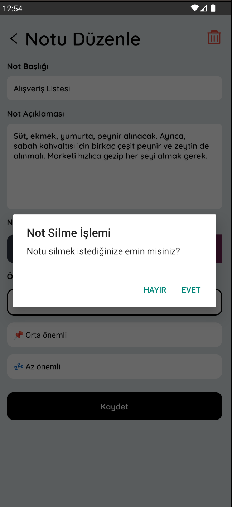

# GDG Workshop - Not Alma Projesi

GDG SDU kulübü kapsamında yapmış olduğumuz **React Native Workshop** etkinliği için geliştirilmiş olan proje.

## ⚙️ Özellikler

- 📝 Özelleştirilebilir not ekleme
- ✏️ Not düzenleme
- 🗑️ Not silme


## 🛠️ Kullanılan Teknolojiler

- React Native
- Javascript
- React Navigation
- AsyncStorage


## 📸 Ekran Görüntüleri


<!-- Satır 1 -->
<p align="center">
  
  &nbsp;&nbsp;&nbsp;&nbsp;&nbsp;&nbsp;
  
  &nbsp;&nbsp;&nbsp;&nbsp;&nbsp;&nbsp;
  
</p>

<!-- Satır 2 -->
<p align="center">
  
  &nbsp;&nbsp;&nbsp;&nbsp;&nbsp;&nbsp;
  
</p>

<br/>

## ⚙️ Kurulum

1. Projeyi klonlayın ve proje dizinine gidin:

   ```bash
   git clone https://github.com/Zecky-dev/GDGWorkshop.git
   
   cd GDGWorkshop
   ````

2. Gerekli Bağımlılıkların Kurulumu

   ```bash
   npm install
   ```

3. Projeyi Çalıştırma
   
   ```bash
   # Android veya iOS'ta çalıştırma

   npx react-native run-android # Android için
   npx react-native run-ios # iOS için
   ```

<br/>

# 📱 Uygulama Kurulumu

Uygulama aşağıdaki şartlar altında test edilmiştir.

- **React Native Versiyon:** 0.78.0
- **NodeJS Versiyon:** 20.16.0
- **İşletim Sistemi:** Android


